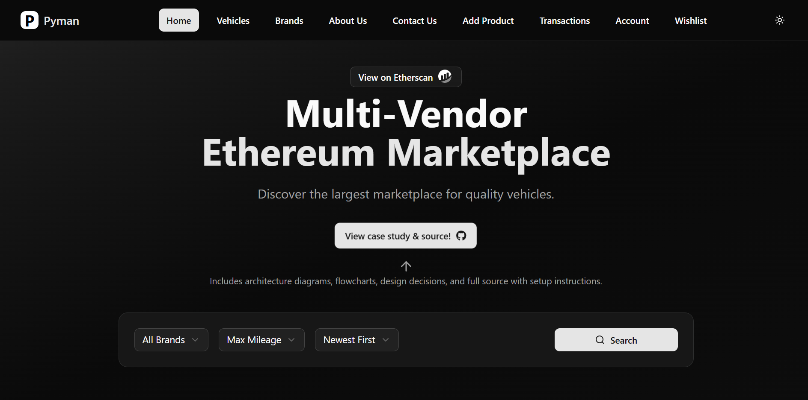

# Pyman — Multi-Vendor Ethereum Vehicle Marketplace 🚗

> A friendly, secure marketplace where people buy and sell vehicles using Ethereum. Pyman pairs a clean shopping experience with on-chain escrow so buyers and sellers transact with confidence.

[📄 View PDF Flowchart](assets/flowchart.pdf)
---

## Table of Contents
- [About](#about)
- [Why Pyman?](#why-pyman)
- [Key Features](#key-features)
- [How It Works (user flow)](#how-it-works-user-flow)
- [Screenshots](#screenshots)
- [Getting Started (for users)](#getting-started-for-users)
- [For Vendors](#for-vendors)
- [Disputes & Returns](#disputes--returns)
- [Tech Stack (short)](#tech-stack-short)
- [Contributing](#contributing)
- [License & Contact](#license--contact)

---

## About
Pyman is a product-focused marketplace built for buying and selling vehicles with Ethereum-powered escrow. It hides blockchain complexity behind a modern storefront, letting users browse vehicles, make purchases with their wallet, and rely on smart contracts to hold funds until the sale is complete.

---

## Why Pyman?
- **Trust:** Payments go into a smart contract escrow until buyers confirm delivery.  
- **Simple UX:** A marketplace feel — browse brands, filter vehicles, save favorites — with wallet integration.  
- **Fairness:** Built-in dispute and refund flows protect both buyers and sellers.

---

## Key Features
- Browse vehicles by brand, mileage, newest listings, and more.  
- Wishlist / favorites and a clear product page for every vehicle.  
- On-chain escrow: funds are locked in a smart contract during the transaction.  
- Clear on-chain transaction states: *initiated → delivered → confirmed → claimed* (or *disputed*).  
- Dispute system and return/refund flow.  
- Vendor dashboard to manage listings and claims.

---

## How It Works (user flow)
A friendly breakdown of what happens when a buyer and vendor transact:

1. **Make a Purchase**  
   - Buyer clicks *Buy* on a vehicle and signs a transaction.  
   - The marketplace calls the smart contract to create a transaction record (`transaction(txn_id, buyer, seller, amount)`) and returns a `txn_id`.  
   - Funds (ETH) are placed into escrow by the contract.

2. **Vendor Delivers Product**  
   - When the vendor ships/delivers the vehicle, they call `deliver(txn_id)`.  
   - Contract updates the transaction status to **delivered** and emits a `Delivered` event.

3. **Buyer Confirms Delivery**  
   - After receiving the vehicle, the buyer calls `satisfy(txn_id)` (confirm).  
   - Contract emits `TransactionConfirmed` and the transaction moves toward settlement.

4. **Vendor Claims Funds**  
   - Vendor calls `claim(txn_id)` to withdraw the escrowed ETH once the transaction is confirmed.  
   - Contract sends ETH to vendor and emits `SellerClaimed`.

5. **If Buyer Disputes**  
   - If an issue appears (e.g., mismatch, damage) the buyer can call `dispute(txn_id)`.  
   - Contract sets status to **disputed** and emits `BuyerDisputed`. This prevents vendor claim until the dispute is resolved.

6. **Return / Refund**  
   - If the vendor accepts return or after resolution, the vendor calls `sellerConfirm(txn_id)` to confirm seller side and trigger refund.  
   - Contract returns ETH to buyer and emits `SellerConfirmed`.

This flow keeps both parties protected and auditable on-chain.

---

## Screenshots
(From the app wireframes / UI images included in the repo.)

- Home / Browse: 

- Make a Purchase / Transaction creation:   
- Vendor marks Delivered:   
- Buyer confirms:   
- Vendor claims funds:   
- Dispute flow:   
- Buyer disputes:   
- Confirm return / refund: 

---

## Getting Started (for users)
These steps are written for shoppers who want to use the Pyman marketplace.

### 1. Prepare your wallet
- Install a web3 wallet (e.g., MetaMask).  
- Connect your wallet to the correct network (the app should indicate if it’s a testnet or mainnet).

### 2. Browse and choose
- Browse vehicles by brand, mileage, or newest listings.  
- Save favorites to your wishlist.

### 3. Buy with confidence
- Click **Buy**, approve the transaction in your wallet. The smart contract will hold funds in escrow.  
- Communicate with the vendor via the listing or order page for shipping/collection info.

### 4. Confirm or dispute
- When you receive the vehicle, confirm delivery in the app to release payment to the vendor.  
- If there’s an issue, open a dispute — this will pause the vendor’s ability to claim funds and trigger dispute resolution steps.

---

## For Vendors
- Create accurate listings with photos, mileage, and clear descriptions.  
- When ready to deliver, call the `deliver` flow in the app to mark the item as shipped/delivered.  
- After the buyer confirms delivery, claim your funds using the `claim` flow.  
- If a return is agreed, use the `sellerConfirm` step to process refunds as needed.

---

## Disputes & Returns
Pyman’s dispute flow is intentionally simple and transparent:
- Buyer initiates `dispute(txn_id)` — transaction becomes **disputed**.
- Marketplace operators or an arbitration process can be used to resolve the dispute (this repo contains the on-chain status and events; off-chain resolution is handled by admins or a trust framework you implement).
- After resolution, the contract supports seller confirmation and refund flows so ETH gets returned when appropriate.

---

## Tech Stack (short)
- Frontend: Modern JS (React/Vue) + wallet integration (Web3 / Ethers.js)  
- Backend: Optional off-chain services for indexing, messaging, and admin tasks  
- Smart Contracts: Solidity (escrow, transaction lifecycle)  
- Deployment: Testnets for development; Mainnet or L2s for production

> If you'd like a developer-focused README too, I can add smart contract docs, ABI snippets, and local setup commands.

---

## Contributing
We welcome contributions! If you'd like to help:
1. Fork the repo.  
2. Create a branch: `feature/awesome-thing`.  
3. Open a PR with clear description and tests (where applicable).  
4. We’ll review and give feedback.

Please open issues for feature requests, bugs, or UX suggestions.

---

## License & Contact
- **License:** MIT (or replace with your chosen license)  
- **Contact / Team:** Add your email or a link to the project website here.

---

## Final notes
Pyman aims to make vehicle buying and selling as simple as browsing a site — while adding the safety of blockchain escrow. If you want, I can:
- Turn this into a developer README with contract ABI, tests, and local setup commands;  
- Polish the screenshots and add a demo GIF;  
- Generate a short marketing blurb for the repo description.