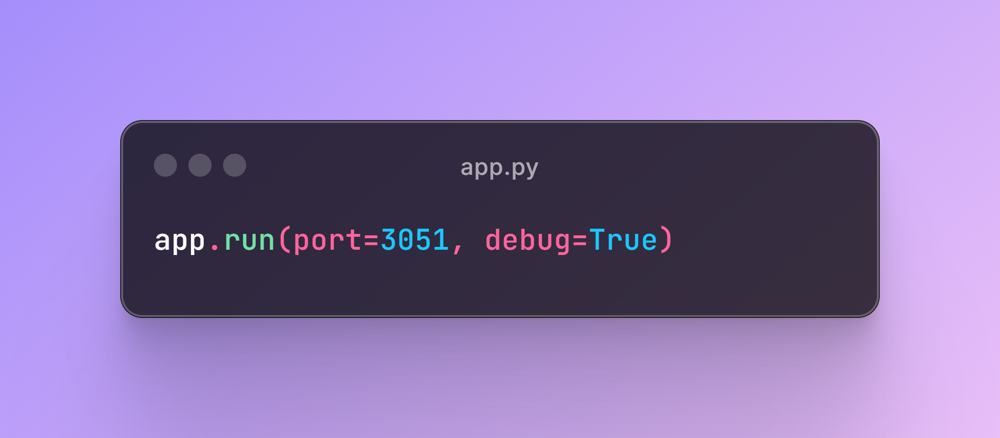
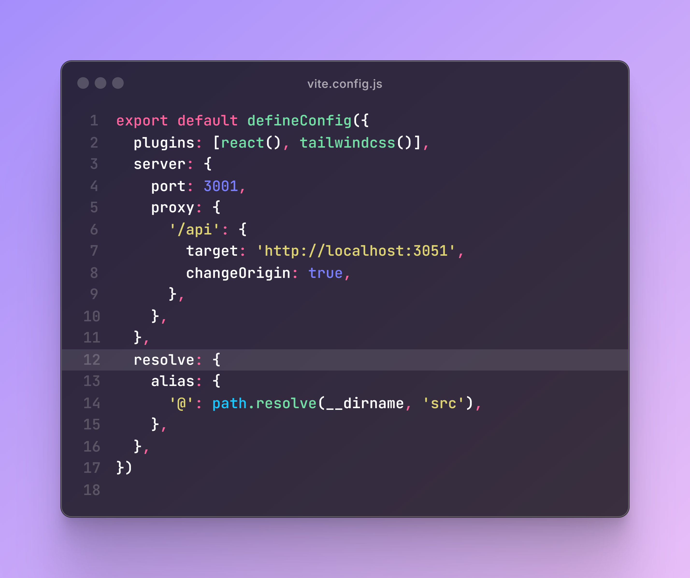

### What actually enables the backend (flask) and frontend (react.js) to interact with each other?
If you look at the last line in the `app.py` file, you'll see:

This tells flask to host the app on port `3051`. Now that our flask app is running on port `3051`, we now need to configure our react app to fetch backend data from that port. To do that, you can see the code in `vite.config.js`, like so:

By default, (when using vite) react runs on port `5173`, line `4` which shows `port : 3001,` asks react not to use the default port but should run on port `3001` instead.
In line `7`, we then configured the react app to send any requests beginning with `/api` to the port `http://localhost:3051`, which is where our flask app is running.

